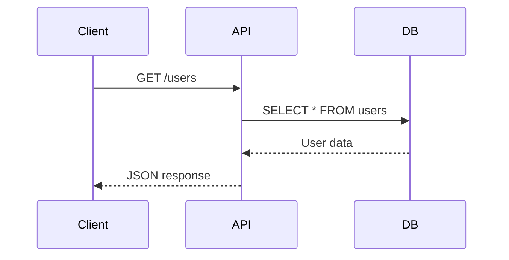
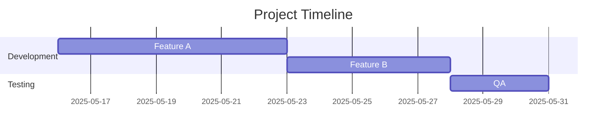

# Mermaid.js V11

## Purpose
Create diagrams, flowcharts, sequence charts, Gantt timelines, and technical visualizations using text-based markdown-inspired syntax. Mermaid renders code into SVG diagrams, enabling version control integration and programmatic diagram generation for documentation.

## When to Use
- Flowcharts and decision trees (business logic, user journeys)
- Sequence diagrams (message flows, API interactions, protocol sequences)
- Class and entity-relationship diagrams (OOP design, database schemas)
- Gantt charts and project timelines
- State machines and workflow diagrams
- Architecture diagrams (C4, block, packet diagrams)
- Git flow visualization and deployment pipelines
- Keeping diagrams in code repositories synchronized with documentation

**Do NOT use when**: Requiring hand-drawn casual aesthetic (use Excalidraw), needing pixel-perfect publication layout (use tech-graph), or building interactive custom graph visualizations (use D3.js directly).

## Workflow
1. **Write diagram syntax** — Use Mermaid DSL (text-based markup) describing nodes, edges, and relationships
2. **Render inline** — Embed `<pre class="mermaid">` tags in HTML/Markdown or use CLI tools
3. **Integrate with docs** — Commit `.md` files containing Mermaid syntax to git; GitHub/GitLab render automatically
4. **Customize styling** — Apply theme variables (colors, fonts, spacing) via config or CSS classes
5. **Export output** — Generate SVG via CLI (`mmdc`) for embedding in PDFs, presentations, or static sites
6. **Iterate in code** — Update syntax; version control tracks diagram evolution alongside codebase changes

## Key Concepts

### Text-Based Syntax
Mermaid diagrams are defined in human-readable DSL syntax. Example flowchart:
```
flowchart TD
  A[User Request] --> B{Valid?}
  B -->|Yes| C[Process]
  B -->|No| D[Error]
```
Syntax resembles Markdown with graph structure declarations, avoiding proprietary binary formats.

### Version Control Integration
Since diagrams are text files, they integrate with git workflows: diffs show syntax changes, branching/merging work as expected, code review comments directly reference diagram nodes. Solves "doc-rot" by keeping diagrams in sync with development.

### Comprehensive Diagram Catalog
Mermaid v11 supports 20+ diagram types: flowcharts, sequences, classes, states, ERD, user journeys, Gantt, pie, quadrant charts, requirement diagrams, Git graphs, C4 diagrams, block diagrams, mindmaps, timelines, Sankey, XY charts, and more.

### Automatic Layout
Nodes and edges auto-position based on graph structure, reducing manual formatting overhead. Layout algorithms optimize for readability; configurable spacing and direction.

## Example
Sequence diagram showing request/response flow:


Gantt chart for project milestones:


## Common Pitfalls
- Overcomplicated syntax causing invalid diagrams (validate in Mermaid Live Editor first)
- Ignoring theme configuration (default styling may clash with doc themes)
- Using flowchart for data pipelines better suited to architecture diagrams
- Not leveraging git integration (storing exported images instead of source syntax)
- Nested/deeply connected nodes causing layout clutter (break into multiple smaller diagrams)
- Assuming browser support for all diagram types (some require recent Mermaid versions)

## References
- [Mermaid Documentation](https://mermaid.js.org) — Official syntax guide, diagram type reference, Live Editor for testing
- [Mermaid GitHub](https://github.com/mermaid-js/mermaid) — Source code, CLI tools (mmdc), integration examples, v11 release notes
- [Mermaid Live Editor](https://mermaid.live) — Web-based editor for syntax testing, SVG export, and instant preview
