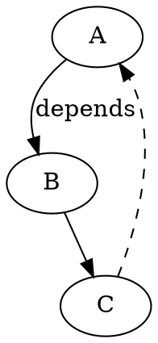
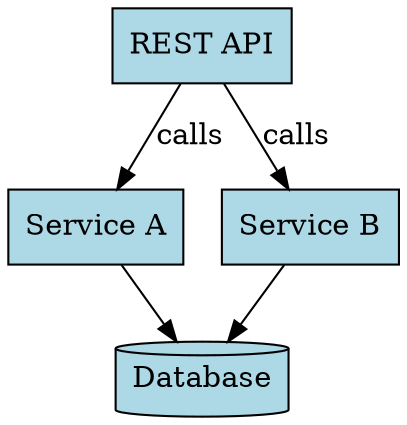

# Tech Graph

## Purpose
Generate publication-quality technical diagrams as SVG code. Tech-graph tools (GraphViz DOT, mingrammer/diagrams, D3.js + Graphviz) render structured architecture, infrastructure, and graph visualizations suitable for documentation, whitepapers, and presentations.

## When to Use
- Cloud architecture diagrams with AWS/Azure/GCP icons (mingrammer/diagrams)
- Directed graphs: dependency trees, call stacks, data pipelines
- Block diagrams and system component hierarchies
- Database schema visualization (entity relationships, cardinality)
- Network topology and infrastructure topology (nodes, clusters, connections)
- Version control friendly diagrams (text-based source, SVG output)
- Automated diagram generation from code (API introspection, config parsing)
- Formal technical documentation and whitepapers requiring polished appearance

**Do NOT use when**: Needing hand-drawn casual style (use Excalidraw), requiring interactive pan/zoom/filters (use D3.js directly), or building real-time dashboards (overhead not justified).

## Workflow
1. **Choose tool** — GraphViz (general graphs via DOT), mingrammer (cloud infra via Python), or D3.js (interactive custom viz)
2. **Define structure** — Write DOT syntax, Python architecture code, or D3 data JSON
3. **Specify styling** — Set node colors, shapes, edge styles, labels, fonts for publication appearance
4. **Generate SVG** — Run `dot -Tsvg`, Python script with diagram rendering, or D3 rendering pipeline
5. **Integrate** — Embed SVG in HTML docs, convert to PDF for reports, commit source to version control
6. **Iterate** — Update source code; regenerate SVG; version control tracks both source and output

## Key Concepts

### GraphViz (DOT Language)
DOT is a graph description language used by GraphViz (AT&T Bell Labs 1991, now open-source) for automatic layout. Define nodes and edges; GraphViz applies layout algorithms (Graphviz, neato, fdp) to compute positions. Output: SVG, PNG, PDF.

Example:


Simple syntax, powerful auto-layout. No explicit positioning; let algorithm optimize.

### Mingrammer/Diagrams (Python)
Diagrams library (Python 3.9+) renders cloud architecture using AWS/Azure/GCP provider icons. Define infrastructure as code; generates Graphviz DOT internally; outputs SVG/PNG. Ideal for visualizing cloud deployments, Kubernetes clusters, on-premises resources.

Example:
```python
from diagrams import Diagram
from diagrams.aws.compute import EC2
from diagrams.aws.database import RDS

with Diagram("Architecture"):
    EC2("web") >> RDS("db")
```

Requires Graphviz installed (`apt-get install graphviz`).

### D3.js + Graphviz (d3-graphviz)
d3-graphviz library combines D3.js rendering with Graphviz layout via WebAssembly. Enables interactive SVG: animated transitions, hover effects, click handlers. Suitable for browser-based diagram exploration.

Performance caveat: SVG rendering slower than Canvas for large graphs; best for <500 nodes.

## Example

**GraphViz (DOT):**


Render: `dot -Tsvg architecture.dot -o architecture.svg`

**Mingrammer (Python):**
```python
from diagrams import Diagram, Cluster
from diagrams.aws.compute import EC2, Lambda
from diagrams.aws.network import ELB
from diagrams.aws.database import RDS

with Diagram("Microservices", show=False):
    lb = ELB("load balancer")
    with Cluster("Compute"):
        web = [EC2("web1"), EC2("web2")]
        api = Lambda("api")
    db = RDS("postgres")
    
    lb >> web >> api >> db
```

Outputs `microservices.png` with AWS icons automatically positioned.

## Common Pitfalls
- Overcomplicated DOT syntax without understanding layout algorithms (start with `digraph`, add styling incrementally)
- Assuming Graphviz installed (mingrammer requires system `graphviz` binary; container/deployment must include it)
- Very large graphs (1000+ nodes) causing slow layout or unreadable output (break into subgraphs or use hierarchical layout)
- Tight coupling between code and visual appearance (separate data structure from styling; use external CSS/theme files)
- Manual SVG editing losing source-of-truth (edit source code, regenerate SVG, never hand-edit SVG)
- Forgetting to commit DOT/Python source alongside SVG (SVG is output artifact; keep source in version control)
- d3-graphviz performance issues with dense graphs (test on target data size; consider canvas-based alternatives for 1000+ nodes)

## References
- [GraphViz Official](https://graphviz.org) — DOT language specification, layout algorithms (Graphviz, neato, fdp), command-line tools
- [Mingrammer/Diagrams](https://diagrams.mingrammer.com) — Python library for cloud architecture diagrams, provider icon library, getting started examples
- [d3-graphviz (npm)](https://www.npmjs.com/package/d3-graphviz) — D3.js integration layer, animated graph transitions, WebAssembly-based Graphviz rendering
- [D3.js Official](https://d3js.org) — General-purpose JavaScript visualization library; foundation for custom interactive diagrams
