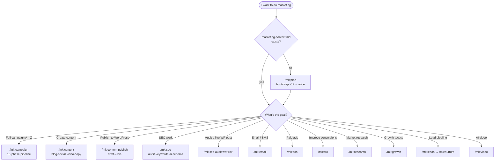
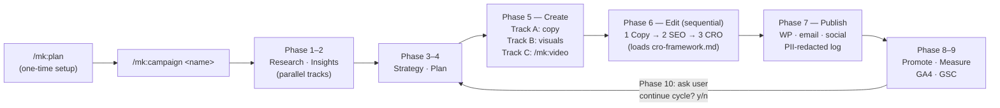
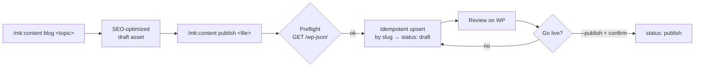
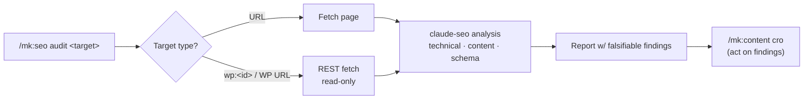
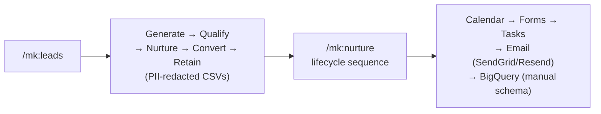

# 🎯 ClauKit Marketing Kit — Guide

> Everything to automate marketing — from campaign planning to community engagement — inside Claude Code via the `/mk:` namespace.

Install with `ck init --kit marketing` (or `--kit both`). Adds **50 marketing skills, 10 agents, 12 commands, 5 workflows, 5 MCP wrappers, WordPress publishing**.

> **The marketing rule**: `/mk:plan` once → it writes the context hub (`plans/marketing-context.md`) → every other `/mk:` command reads from it. Plan once, run many. Every `/mk:` command **except** `/mk:plan` hard-fails without the hub.

For the full kit reference (skill list, agents, MCP setup, source repos) see [`skills/marketing/README.md`](./skills/marketing/README.md).

---

## 1. Giới thiệu (Introduction)

The marketing kit turns Claude Code into a full marketing team. It ships:

- **Curated skills** — SEO (via `AgriciDaniel/claude-seo`, 25 sub-skills + 18 agents), content, email/SMS, paid ads, CRO, research, growth, lead pipeline, AI video.
- **A context hub** — `plans/marketing-context.md` (ICP, positioning, brand voice, competitors, goals, channels) — the single source of truth keeping every output on-brand.
- **Gated, idempotent automation** — draft-by-default publishing, PII redaction, deterministic keys so re-runs never duplicate sends.
- **Bring-your-own MCP** — GA4, GSC, SendGrid, Resend, ReviewWeb, WordPress — each with a manual fallback so the kit works with zero MCP servers configured.

---

## 2. Đối tượng (Who it's for)

| User | Use case | Commands |
|---|---|---|
| **Solo founder** | Full campaign cycle without an agency | `/mk:plan` + `/mk:campaign` |
| **SMB shop owner** | Content + ads at scale | `/mk:content` + `/mk:ads` |
| **Marketing manager** | Standardized, repeatable process | All 5 workflows |
| **Agency** | Client delivery framework | All commands + workflows |
| **B2B SaaS** | Lead pipeline | `/mk:leads` + `/mk:nurture` |
| **Content creator** | Multi-platform content | `/mk:content` + `/mk:video` |
| **E-commerce** | Product + ads | `/mk:ads` + `/mk:cro` |
| **Local business** | Local SEO | `/mk:seo` + `seo-local` skill |

**Service domains**: real estate, e-commerce, SaaS, edtech, F&B, healthcare/clinic, agencies, freelancers, B2B services, content creators.

---

## 3. Cách sử dụng workflow (How to use — workflows)

### 🧭 Decision tree — which command do I need?

---

### Flow 1 — 🚀 Full campaign (the flagship)

`/mk:campaign` runs the complete 10-phase pipeline — research → insights → strategy → plan → create → edit → publish → promote → measure → optimize (loops back to strategy, user confirms each cycle).

**When to use**: you want the whole machine. For a single asset, reach for the focused commands instead. Sub-workflows (`/mk:leads`, `/mk:nurture`, `/mk:video`) are orchestrated by this pipeline — campaign name is passed automatically.

---

### Flow 2 — ✍️ Content → WordPress publish

Generate SEO content, then push it to a live WordPress site. **Draft by default** — going live is an explicit, confirmed step.

**Env required**: `WP_SITE_URL`, `WP_USER`, `WP_APP_PASSWORD` (Application Password — env only, never hardcoded). Re-publishing updates the same post by slug — **never duplicates**. Optional MCP server via the `mcp-wordpress` skill; falls back to the curl REST path automatically.

---

### Flow 3 — 🔎 SEO — create & audit (incl. live WordPress posts)

Routes through the `AgriciDaniel/claude-seo` engine (25 sub-skills + 18 agents in parallel). Audit a URL **or a live WordPress article** by id/URL — fetched read-only, then analyzed.

**Read-only**: the audit path never writes to your site. Fixes come back as recommendations; applying them goes through the separate publish flow.

---

### Flow 4 — 📈 Lead pipeline (B2B)

**When to use**: SaaS / B2B with a funnel. `/mk:leads` runs the 5-phase pipeline; `/mk:nurture` drives the lifecycle sequence per lead stage. Both are orchestrated by `/mk:campaign` when running the full pipeline, or usable standalone (each prompts for campaign name).

---

## 4. Use cases — scenario → command

| Scenario | Command | Chain after |
|---|---|---|
| 🔧 First-time setup (ICP, voice) | `/mk:plan [-o md\|html]` | → any `/mk:` command |
| 🚀 Full campaign | `/mk:campaign <name>` | (end-to-end pipeline) |
| ✍️ Blog / social / video / copy | `/mk:content [blog\|social\|video\|copy]` | → `/mk:content publish` |
| 📤 Publish to WordPress | `/mk:content publish <file> [--publish]` | (draft → live) |
| 🔎 SEO audit / keywords / schema | `/mk:seo [audit\|keywords\|ai\|schema]` | → `/mk:content cro` |
| 🔍 Audit a live WP post | `/mk:seo audit wp:<id>` | (read-only) |
| 📧 Email & SMS | `/mk:email` | (campaign · cold · drip · sms) |
| 📢 Paid ads | `/mk:ads` | (google · meta · creative · a/b) |
| 🎯 Conversion optimization | `/mk:cro` | (audit · landing · signup) |
| 🔬 Market research | `/mk:research` | → `/mk:plan` (refine ICP) |
| 🌱 Growth tactics | `/mk:growth` | (launch · referral · free-tool) |
| 📈 Lead pipeline | `/mk:leads` | → `/mk:nurture` |
| 🎬 AI video | `/mk:video` | (script → render → distribute) |

### Patterns at a glance

**Context hub first**: `/mk:plan` writes `plans/marketing-context.md`. No hub → every other `/mk:` command refuses to run. This is by design — it forces a single source of truth for ICP/positioning/voice so all output stays on-brand.

**SEO is parallel**: `/mk:seo` doesn't run one checker — it dispatches up to 15 claude-seo sub-skills simultaneously, then synthesizes. Every finding ships with a *falsifiability check* ("how would we know this failed?").

**WordPress is draft-safe**: publishing is outward-facing and hard to reverse, so `/mk:content publish` always writes a **draft** first. Live publish requires `--publish` + an explicit confirmation echoing the target URL + title. Re-runs upsert by slug (idempotent).

**MCP optional, fallback always**: GA4, GSC, SendGrid, Resend, ReviewWeb, and WordPress all have MCP wrappers — but each has a **manual fallback** (CSV paste, template generation, curl path). The kit works without any MCP server configured.

**Idempotent by design**: every automation uses a deterministic key (`campaign-name + step + recipient-id`) — re-running a campaign never duplicates sends. Phase 10 optimize loop always asks the user before starting the next cycle.

---

> Full kit reference — command list, agents, workflows, MCP setup, source repos — in [`skills/marketing/README.md`](./skills/marketing/README.md).
