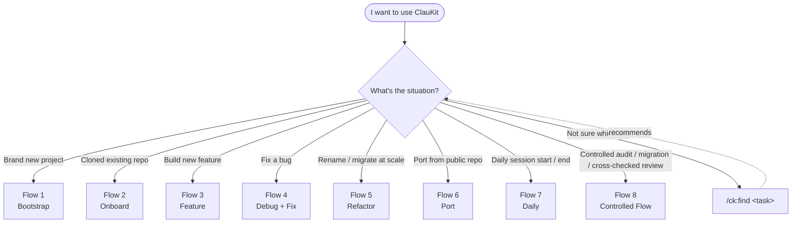
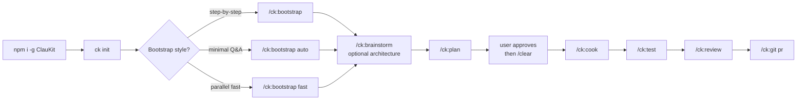
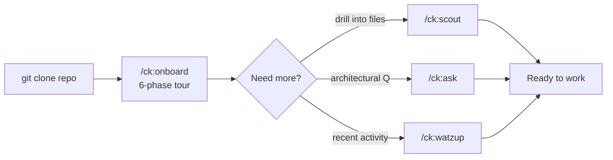
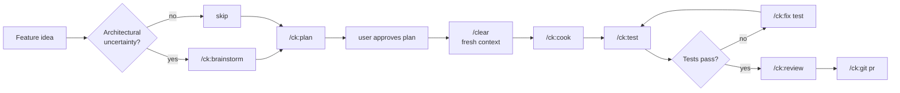
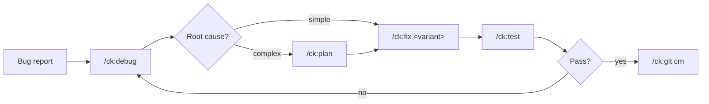
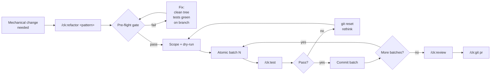
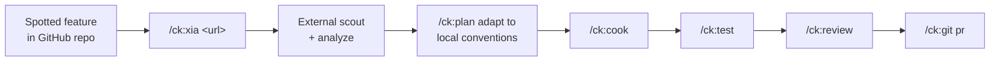
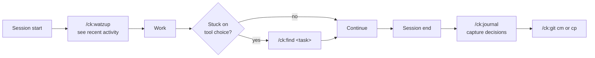
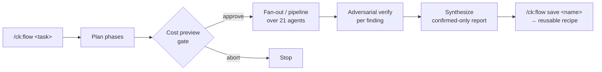

# ClauKit — The Opinionated Multi-Agent Orchestration Framework for Claude Code

*128 skills · 31 agents · 72 gated commands · atomic-commit safety · MCP-ready · 3 installable kits*

[](https://github.com/trungdo9/ClauKit/stargazers)
[](https://opensource.org/licenses/MIT)
[](https://github.com/trungdo9/ClauKit/releases)
[](https://github.com/topics/claude-code-template)

Claude Code gives you the primitives — but no opinions on how to combine them. You're left to invent your own workflows, manage parallel agents by hand, and hope you don't `git push` a broken refactor. Most Claude Code templates throw a thousand skills at the wall and call it a day.

**ClauKit is the opinionated alternative.** 128 curated skills, 31 specialized agents, 72 gated commands — each one earns its place. Built-in pre-flight checks block destructive operations. Multi-agent orchestration via `/ck:team` and `/ck:flow` runs parallel Claude Code work safely. **3 installable kits** — engineer (default), marketing, both.

> Plan once. `/clear` context. Cook with confidence. That's the ClauKit workflow.

## Why ClauKit

- **Gated pipelines, not gambling.** `/ck:refactor` and `/ck:cook` enforce pre-flight gates — clean working tree, tests green, not on `main`. See [`.claude/workflows/primary-workflow.md`](./.claude/workflows/primary-workflow.md). Skip the gates and the command refuses to run.
- **Trio architecture — one concept, one entry point.** Every skill (knowledge) maps to an agent (persona) and a command (`/ck:<name>` trigger). No tool roulette. Full map in [`docs/clauKit-registry.md`](./docs/clauKit-registry.md).
- **Curated, not crawled.** 74 skills hand-selected for AI dev workflows — research, planning, refactoring, testing, code review, SEO, payments. Each maintained, each documented, each in the registry. No abandoned scaffolds.

## Quick Start

```bash
# 1. Install from GitHub (not yet on npm)
npm install -g https://github.com/trungdo9/ClauKit.git

# 2. Drop ClauKit into your project — pick a kit
cd /path/to/your-project
ck init                       # Engineer kit (default): /ck: namespace
ck init --kit marketing       # Marketing + automation: /mk: namespace
ck init --kit both            # Both kits combined
ck init --kit list            # List available kits

# 3. Launch Claude Code — try /ck:find to discover commands
claude
```

> Pull latest with `ck update`. Other install paths (npx, clone-as-template, MCP setup) are collapsed below.

<details>
<summary><strong>Other install options (npx · clone · MCP)</strong></summary>

### Prerequisites
- [Claude Code](https://code.claude.com) installed and configured
- Git for version control
- Node.js 18.0.0 or higher

### Option 2: Run without installation

```bash
npx github:trungdo9/ClauKit init
```

### Option 3: Clone and customize

```bash
git clone https://github.com/trungdo9/ClauKit.git your-project-name
cd your-project-name
claude
```

### Option 4: GitHub MCP Integration (Optional)

```bash
cp .claude/.env.example .claude/.env
# Add your GitHub Personal Access Token from https://github.com/settings/tokens/new?scopes=repo
# Edit .claude/.env and set GITHUB_TOKEN=ghp_xxx...
# Restart Claude Code to activate MCP
```

### CLI Commands

```bash
ck init              # Copy .claude folder to current directory
ck init --force      # Overwrite existing files (back up local changes first)
ck update            # Pull latest version from GitHub
ck help              # Show help information
```

> `ck init` only copies `.claude/`. Other assets shipped in the package (`.opencode/`, `AGENTS.md`, `docs/`, `CLAUDE.md`) are only available via Option 3 (clone-as-template).

</details>

---

## Use Cases & Workflows

This section maps **every common situation** a developer faces to the exact ClauKit commands to use. Start with the master decision tree, then drill into the matching flow.

### 🧭 Master decision tree — which flow do I need?



> **Lost?** Run `/ck:find <task description>` — it recommends the best skill / agent / command for your task from the local registry.

---

### Flow 1 — 🆕 Brand new project (greenfield)

Start from zero — scaffold project, decide architecture, ship first version.



**When to use**: empty folder, fresh idea. Pick `auto` if you trust ClauKit defaults; `fast` for max parallelism; default for full control.

---

### Flow 2 — 👋 Joined existing project (onboarding)

Just cloned a repo — get oriented in 10 minutes, ready to work.



**When to use**: new joiner OR returning after long absence. `/ck:onboard` reads existing docs + maps entry points + suggests first task — does NOT regenerate docs.

---

### Flow 3 — ✨ Build a new feature

Feature idea → production. Primary workflow.



**When to use**: any non-trivial change with feature semantics (new endpoint, new screen, new flow). Skip `/ck:brainstorm` for well-understood patterns.

---

### Flow 4 — 🐛 Fix a bug

Investigate → fix → verify → ship.



**`/ck:fix` variants** — pick the matching context:

| Variant | Use when |
|---|---|
| `/ck:fix ci` | GitHub Actions / CI pipeline failing |
| `/ck:fix logs` | Error logs from server / runtime |
| `/ck:fix test` | Failing tests |
| `/ck:fix types` | TypeScript / mypy errors |
| `/ck:fix ui` | UI / styling / layout issues |

Combinable flags: `--auto` · `--review` · `--quick` · `--parallel`.

---

### Flow 5 — 🔄 Refactor at scale

Rename · extract · migrate · codemod. Behavior-preserving mechanical change.



**When to use**: distinct from `/ck:cook` (feature) and `/ck:fix` (bug). If the change alters behavior → use `/ck:cook` instead. Pre-flight gate blocks if working tree dirty, tests red, or on `main`.

---

### Flow 6 — 📦 Port a feature from a public GitHub repo

Found a feature in someone else's repo, want to bring it in (and improve / adapt).



**Flags**: `--improve` (apply local-codebase patterns) · `--compare` (side-by-side diff with existing).

---

### Flow 7 — 📅 Daily working session

Resume → work → wrap up. Lightweight loop.



**Tip**: `/ck:find` is your meta-helper across 74 skills + 60 commands. Use it whenever you think "there's probably a ClauKit tool for this".

---

### Flow 8 — 🎛 Controlled audit / migration / cross-checked review

Deterministic large-ish fan-out + verification, **under explicit control** — gated, cost-previewed, inspectable. `/ck:flow` re-creates Claude Code's dynamic-workflow model on ClauKit's own controllable primitives; it does **NOT** use the native `ultracode` runtime.



Also available as flag-variants on existing commands: `/ck:fix --flow` (gates as agent stages + adversarial-verify root cause before implement) and `/ck:review --flow` (dimension fan-out → per-finding verify → confirmed-only report). They **complement** the canonical pipelines, never replace them.

---

### 📋 Quick reference — scenario → command

Specialized journeys with single-command entry points.

| Scenario | Command | Chain after |
|---|---|---|
| 🆕 New project scaffold | `/ck:bootstrap [auto\|fast]` | → `/ck:plan` → `/ck:cook` |
| 👋 Tour codebase | `/ck:onboard [focus]` | → `/ck:scout` / `/ck:ask` |
| ❓ Codebase Q&A (read-only) | `/ck:ask <question>` | (standalone) |
| 🔍 Find files / symbols | `/ck:scout <prompt> [-ext]` | (standalone) |
| 🌐 External research | `/ck:research <topic>` | → `/ck:plan` |
| 💡 Architectural debate | `/ck:brainstorm <topic>` | → `/ck:plan` |
| 📋 Plan implementation | `/ck:plan [fast\|hard\|two\|ci\|cro] [-o md\|html]` | → `/clear` → `/ck:cook` |
| 🍳 Implement feature | `/ck:cook` | → `/ck:test` → `/ck:review` |
| 🧪 Run tests | `/ck:test` | → `/ck:fix test` if failing |
| 🔍 Code review | `/ck:review` | → `/ck:fix` |
| 🐛 Debug issue | `/ck:debug <issue>` | → `/ck:fix` |
| 🔧 Fix issue | `/ck:fix [ci\|logs\|test\|types\|ui]` | → `/ck:test` |
| 🔄 Large refactor | `/ck:refactor <pattern>` | → `/ck:test` → `/ck:review` |
| 📦 Port from GitHub | `/ck:xia <url> [--improve\|--compare]` | → `/ck:cook` |
| 🎨 UI / UX design | `/ck:design [fast\|good\|3d\|...]` | → `/ck:cook` |
| 🖼 Fix UI issue | `/ck:fix ui` | → `/ck:test` |
| 📚 Init docs | `/ck:docs init` | (one-shot) |
| 📚 Update docs | `/ck:docs update` | (after feature) |
| 📚 Docs summary | `/ck:docs summarize` | (read-only) |
| ✍️ Marketing copy | `/ck:content [fast\|good\|enhance\|cro]` | (standalone) |
| 🔎 SEO work | `/ck:seo [audit\|keywords\|schema] <target>` | → `/ck:content cro` |
| 💳 SePay payment | `/ck:sepay <tasks>` | → `/ck:test` |
| 🔌 Use MCP server | `/ck:use-mcp <server-name>` | (standalone) |
| 👥 Parallel team | `/ck:team <template> [...]` | (orchestration) |
| 🎛 Controlled orchestration | `/ck:flow <task>` · `/ck:fix --flow` · `/ck:review --flow` | (gated fan-out/pipeline) |
| 🧩 Create / edit skill | `/ck:cc-skill [create\|add\|optimize\|fix-logs]` | (extend ClauKit) |
| 📝 Write journal | `/ck:journal` | (end-of-session) |
| 📊 Recent changes | `/ck:watzup` | (start-of-session) |
| 📤 Git commit | `/ck:git cm` | (or `cp` to push) |
| 🔀 Open PR | `/ck:git pr [to] [from]` | (after `cm`) |
| 🔀 Merge PR | `/ck:git merge [pr#\|branch]` | (interactive) |
| 🤷 Don't know which tool | `/ck:find <task>` | recommends + chains |

---

### 🎯 Workflow patterns at a glance

**The trio rule**: most concepts have a `skill` (knowledge) + `agent` (persona) + `command` (trigger). Always start with the command — the skill/agent activate automatically. See [`docs/clauKit-registry.md`](./docs/clauKit-registry.md) for the full map.

**Plan → /clear → Cook**: for non-trivial features, always plan first, then `/clear` to reset context, then implement. This is enforced in `primary-workflow.md`.

**Plan output formats**: `/ck:plan` writes markdown by default (`plan.md` + `phase-*.md`) — always the source of truth that `/ck:cook` consumes. Add `-o html` to ALSO render a single self-contained `plan.html` view (TOC nav, collapsible phases, status badges + progress bar, diagrams, highlighted code — opens offline, zero dependencies). It's a one-directional snapshot; markdown stays primary. Re-render anytime — including for a plan made earlier — with `/ck:plan <path-to-plan.md> -o html` (skips planning, just converts).

**Gated pipelines**: `/ck:refactor` and `/ck:cook` enforce pre-flight + verification gates. Don't bypass — they exist because skipping them caused incidents.

**Dispatcher commands** (positional args, no dash): `/ck:plan`, `/ck:fix`, `/ck:git`, `/ck:docs`, `/ck:cc-skill`, `/ck:seo`, `/ck:content`, `/ck:design`, `/ck:bootstrap`, `/ck:scout`. Combinable `--flags`: `/ck:fix` (`--auto/--review/--quick/--parallel/--flow`), `/ck:review` (`--flow`).

**Controlled orchestration**: `/ck:flow` re-creates Claude Code's dynamic-workflow model on ClauKit's own controllable primitives (markdown recipes + Agent-tool fan-out/pipeline over the 21 agents, 4-axis inheritance, gated + cost-previewed) — it does **NOT** use the native `ultracode` runtime. Use it (or `/ck:fix --flow` / `/ck:review --flow`) for deterministic audits, migrations, and cross-checked reviews; use `/ck:team` when workstreams need persistent sessions + discussion.

## Multi-Agent Orchestration: `/ck:team` vs `/ck:flow`

ClauKit ships two orchestration commands — each for a different kind of parallel work. Picking the wrong one wastes tokens; picking the right one saves hours.

### Quick decision

| Situation | Use |
|---|---|
| 3+ workstreams that need to **discuss / hand off context** mid-flight | `/ck:team` |
| Deterministic fan-out over repo/N-files, **gated + cost-previewed** | `/ck:flow` |
| Single-turn parallel reads, no inter-agent discussion | direct Agent tool (cheapest) |
| Full autonomous orchestration (no explicit control needed) | — ClauKit does not expose `ultracode` |

---

### `/ck:team` — Persistent multi-session teammates

Spawns independent Claude Code sessions as **persistent teammates** — each with its own context window, task ownership, and cross-session memory (`.claude/agent-memory/<name>/`). Teammates communicate, discuss findings, and hand off context mid-flight. Unlike subagents (fire-and-forget), teammates are persistent and event-driven.

**Templates**

| Template | Teammates | Best for | Token budget |
|---|---|---|---|
| `research` | 2–4 researchers | Competitive analysis, multi-source investigation | 150–300K (haiku) |
| `cook` | 1 lead + N devs | Parallel feature implementation | 400–800K (sonnet+haiku) |
| `review` | 2–3 reviewers | Code quality, security, performance audits | 100–200K (haiku) |
| `debug` | 3 debuggers | Root-cause via competing hypotheses | 200–400K (sonnet) |

**Usage**
```
/ck:team <template> [context] [flags]

/ck:team cook "implement auth + notifications + dashboard" --devs 3
/ck:team debug "race condition in payment flow" --plan-approval
/ck:team research "compare React state management" --researchers 2
/ck:team review --reviewers 2
```

Flags: `--devs N` · `--researchers N` · `--reviewers N` · `--debuggers N` · `--plan-approval` (lead approves before teammates code) · `--delegate` (lead coordinates only, never touches code).

> Requires Claude Code ≥ 2.1.33 (or `CLAUDE_CODE_EXPERIMENTAL_AGENT_TEAMS=1` on older). Falls back to subagent delegation if unavailable.

**Avoid** `/ck:team` when: task is single-focused, fully sequential, or token budget is tight — use a subagent instead.

---

### `/ck:flow` — Controllable deterministic fan-out

Orchestrates from **within the main session** — decomposes a task into phases, fans out over the 21 ClauKit agents, gates between phases, and synthesizes a single confirmed-only report. Re-creates Claude Code's dynamic-workflow model on ClauKit's own primitives. **Does NOT use the native `ultracode` runtime or `Workflow` tool.**

**4-stage execution**

1. **PLAN** — decompose task → phases, each with a persona (`subagent_type`), shape (fan-out | pipeline), gate set, model.
2. **PREVIEW (mandatory gate)** — cost estimate range shown; user approves / adjusts / aborts. Nothing runs without approval. `--dry-run` stops here.
3. **ORCHESTRATE** — execute phases; inspect/abort offered between each phase (control advantage over the native runtime).
4. **SYNTHESIZE** — orchestrator consolidates child reports into a single confirmed-only report.

**Quality patterns** (borrowed from the native dynamic-workflow model, expressed as ClauKit fan-out/pipeline):

| Pattern | What it does |
|---|---|
| **Adversarial verify** | N skeptic agents per finding, each prompted to *refute*. Filters plausible-but-wrong results. |
| **Judge panel** | N independent attempts from different angles → score → synthesize from winner. |
| **Loop-until-dry** | Re-spawn finders until K consecutive rounds yield nothing new. Catches the tail a single pass misses. |
| **Multi-modal sweep** | Parallel agents each searching a different way (by-container, by-content, by-entity). |
| **Completeness critic** | Final agent asks "what's missing?" → its findings become the next round. |

**Usage**
```
/ck:flow <task>
/ck:flow <task> --model opus --dry-run   # preview plan + estimate, no orchestration
/ck:flow save <name>                     # persist last run as reusable recipe
/ck:flow list                            # list saved recipes in .claude/workflows/
```

Flag variants on existing commands: `/ck:fix --flow` · `/ck:review --flow`.

**Best for**: whole-repo security audit, N-file migration, cross-checked code review, multi-angle planning.

---

### ClauKit orchestration vs Claude Code native features

Claude Code ships built-in primitives: the **Agent tool** (subagents), **dynamic workflows** (research preview, native `ultracode` runtime), and **worktrees**. ClauKit's two orchestration commands are built on top of — and extend — these primitives.

| Capability | Claude Code native (Agent tool / ultracode) | `/ck:team` | `/ck:flow` |
|---|---|---|---|
| **Execution context** | Background JS runtime (ultracode) or inline subagent | Independent CC sessions | Main session — orchestrator stays in control |
| **Inter-agent communication** | Structured output only | Full discussion + task messaging | Shared `plans/<plan>/reports/` dir |
| **Persistent cross-session memory** | No | Yes (`.claude/agent-memory/`) | No |
| **Cost preview gate** | No | No | Yes — mandatory before any fan-out |
| **Mid-run inspect / abort** | No | Via `TaskList` | Yes — offered between every phase |
| **Pre-flight safety gates** | No | Inherited from ClauKit | Inherited from ClauKit |
| **Reusable saved recipes** | No | No | Yes — `/ck:flow save <name>` |
| **Token budget** | — | Higher (N × full context windows) | Moderate (fan-out per phase, haiku/opus mix) |
| **Best for** | One-turn quick reads | 3+ workstreams that need to discuss | Audits, migrations, cross-checked reviews |

**Rule of thumb:**

```
one-turn parallel reads, no discussion  →  Agent tool directly (cheapest)
3+ workstreams + discussion + handoff   →  /ck:team
deterministic fan-out + gates + cost    →  /ck:flow
ultracode / native dynamic-workflow     →  not used — /ck:flow is the ClauKit substitute
```

---

## 🎯 Marketing Kit

Install with `ck init --kit marketing` (or `--kit both`). Adds the **`/mk:` namespace** — 50 marketing skills, 10 agents, 12 commands, plus WordPress publishing. Every `/mk:` command (except `/mk:plan`) **hard-fails without `plans/marketing-context.md`** — the hub holding your ICP, positioning, brand voice, competitors, goals, and channels.

> **The marketing rule**: `/mk:plan` once → it writes the context hub → every other `/mk:` command reads from it. Plan once, run many.

**→ Full marketing guide** (introduction, audience, workflow diagrams, use cases): **[`MARKETING.md`](./MARKETING.md)**. Kit-internal reference (skills, agents, MCP setup): [`skills/marketing/README.md`](./skills/marketing/README.md).

---

## ClauKit vs Other AI Coding Tools

Different tools for different jobs. **Cursor** and **Windsurf** are agentic IDEs — they replace your editor. **Aggregate Claude Code templates** (community-curated, often 1000+ skills) take the kitchen-sink approach. **Google Antigravity** is an autonomous agent runtime. **ClauKit** is a curated framework that runs *inside* Claude Code — opinionated workflows, gated safety, multi-agent orchestration. Pick the right tool for the job; they're complementary, not exclusive.

| Capability | ClauKit | Aggregate CC templates | Cursor | Windsurf | Antigravity |
|---|---|---|---|---|---|
| Category | Framework | Template | Agentic IDE | Agentic IDE | Autonomous runtime |
| Multi-agent orchestration | ✅ `/ck:team` | Partial | Composer | Cascade | ✅ |
| Pre-flight safety gates | ✅ atomic commits | ❌ | ❌ | ❌ | Partial |
| Skill + agent + command trio | ✅ | Skills only | ❌ | ❌ | ❌ |
| MCP server integration | ✅ | ✅ | ✅ | ✅ | Partial |
| Runs inside Claude Code | ✅ | ✅ | ❌ own runtime | ❌ own runtime | ❌ |
| Curated vs comprehensive | Curated (80) | Comprehensive (1000+) | N/A | N/A | N/A |
| License | MIT | MIT | Commercial | Commercial | Commercial |

### When NOT to use ClauKit

ClauKit isn't for everyone. If you want an editor with AI baked in → use [Cursor](https://cursor.com) or [Windsurf](https://windsurf.com). If you want every Claude Code skill ever published → browse [`github.com/topics/claude-code-template`](https://github.com/topics/claude-code-template) for aggregate templates. If you need a fully autonomous agent that runs unsupervised → look at AutoGPT or Antigravity. ClauKit is for developers who want **opinionated workflows inside Claude Code** with safety gates and curation — not raw scale.

> *Comparison reflects published feature sets as of 2026-05-23. Sources: [Cursor docs](https://docs.cursor.com/), [Windsurf docs](https://docs.windsurf.com/), [Anthropic Claude Code](https://code.claude.com/docs), [Google Antigravity blog](https://antigravity.google/). Capabilities marked ✅/❌/Partial reflect each vendor's flagship offering and may evolve.*

## Project Structure

```
claukit/
├── .claude/                    # Claude Code configuration
│   ├── agents/                 # Specialized agent definitions (21 agents)
│   ├── commands/               # Slash command implementations (60 commands)
│   ├── hooks/                  # Git hooks and scripts
│   ├── skills/                 # Specialized skills library (74 skills)
│   ├── workflows/              # Development workflow definitions
│   ├── settings.json           # Claude Code settings
│   ├── metadata.json           # Project metadata
│   ├── .env.example            # Environment template
│   ├── .gitignore              # Git exclusions
│   ├── .mcp.json.example       # MCP configuration template
│   ├── statusline.sh           # Bash statusline script
│   ├── statusline.ps1          # PowerShell statusline script
│   └── statusline.js           # Node.js statusline script
├── .opencode/                  # OpenCode CLI configuration
│   ├── agent/                  # Agent definitions
│   └── command/                # Command definitions
├── .github/                    # GitHub configuration
│   └── workflows/              # CI/CD workflows
├── docs/                       # Project documentation
├── plans/                      # Implementation plans and reports
├── scripts/                    # Setup and utility scripts
├── CLAUDE.md                   # Project instructions for Claude
├── README.md                   # This file
├── package.json                # Node.js dependencies
├── .releaserc.json             # Semantic release configuration
├── .commitlintrc.json          # Commit linting rules
├── (CHANGELOG.md)              # Auto-generated by semantic-release on first release
└── LICENSE                     # MIT License
```

## Core Features

### AI Agent System

**21 Specialized Agents**:

| Category | Agents |
|----------|--------|
| Planning | `planner`, `researcher`, `brainstormer` |
| Development | `frontend-developer`, `backend-developer` |
| Quality | `tester`, `code-reviewer`, `debugger`, `performance-agent`, `security-auditor` |
| Documentation | `docs-manager`, `journal-writer` |
| Operations | `git-manager`, `project-manager`, `database-admin`, `mcp-manager`, `integration-agent` |
| Implementation | `scout`, `scout-external`, `ui-ux-designer` |
| Specialized | `copywriter` |

### Slash Commands (26)

All dispatcher commands use **positional args** (no dash prefix) for mode selection. Only `/ck:fix` uses `--flags` for combinable modifiers.

| Command | Modes / Usage |
|---------|---------------|
| `/ck:ask` | `<question>` |
| `/ck:bootstrap` | `[auto\|fast]` |
| `/ck:brainstorm` | `<topic>` |
| `/ck:cc-skill` | `[add\|create\|optimize\|fix-logs] <args>` |
| `/ck:content` | `[fast\|good\|enhance\|cro] <request>` |
| `/ck:cook` | `[task or plan-path] [--fast\|--auto\|--from-plan\|--no-test]` |
| `/ck:debug` | `<issue>` |
| `/ck:design` | `[fast\|good\|3d\|screenshot\|describe\|ui-ux-pro-max] <request>` |
| `/ck:docs` | `[init\|update\|summarize]` |
| `/ck:find` | `<task-description>` |
| `/ck:fix` | `[ci\|logs\|test\|types\|ui] [--auto] [--review] [--quick] [--parallel] <issue>` |
| `/ck:git` | `[cm\|cp\|pr\|merge]` |
| `/ck:journal` | `(no args)` |
| `/ck:onboard` | `[optional-focus-area]` |
| `/ck:plan` | `[fast\|hard\|two\|ci\|cro] <task> [-o md\|html]` · `<plan.md> -o html` (convert existing plan → HTML) |
| `/ck:refactor` | `<refactor-pattern>` |
| `/ck:research` | `<topic>` |
| `/ck:review` | `[tasks-or-prompt]` |
| `/ck:scout` | `<prompt> [scale] [-ext]` |
| `/ck:seo` | `[audit\|keywords\|schema] <target>` |
| `/ck:sepay` | `<tasks>` |
| `/ck:team` | `<template> [context] [--devs\|--reviewers\|--researchers\|--debuggers N]` |
| `/ck:test` | `(no args)` |
| `/ck:use-mcp` | `<server-name>` |
| `/ck:watzup` | `(no args)` |
| `/ck:xia` | `<github-url> [feature] [--improve\|--compare]` |

### Workflows

- **Primary Workflow** (`primary-workflow.md`) - Implementation cycle
- **Development Rules** (`development-rules.md`) - Coding standards
- **Orchestration Protocols** (`orchestration-protocol.md`) - Agent coordination
- **Documentation Management** (`documentation-management.md`) - Doc maintenance

## Development Principles

- **YAGNI** - You Aren't Gonna Need It
- **KISS** - Keep It Simple, Stupid
- **DRY** - Don't Repeat Yourself
- Files under 200 lines for optimal context management
- Try-catch error handling
- Security-first development

## Configuration

### Claude Code Settings

Configure in `.claude/settings.json`:

```json
{
  "hooks": {
    "BeforeBash": [{
      "type": "command",
      "command": "node ${CLAUDE_PROJECT_DIR}/.claude/hooks/scout-block.js"
    }]
  }
}
```

### Environment Variables

Copy `.claude/.env.example` to `.claude/.env` and configure:

- `ANTHROPIC_API_KEY` - Anthropic API key
- `GEMINI_API_KEY` - Google Gemini API key (optional)

## Documentation

All documentation is maintained in `./docs`:

- [Project Overview & PDR](./docs/project-overview-pdr.md)
- [Codebase Summary](./docs/codebase-summary.md)
- [Code Standards](./docs/code-standards.md)
- [System Architecture](./docs/system-architecture.md)
- [Project Roadmap](./docs/project-roadmap.md)
- [Design Guidelines](./docs/design-guidelines.md)
- [Deployment Guide](./docs/deployment-guide.md)

## Frequently Asked Questions

<details>
<summary><strong>What is ClauKit and how is it different from aggregate Claude Code templates?</strong></summary>

ClauKit is an opinionated multi-agent orchestration framework for Claude Code with 74 curated skills, 21 agents, and 60 gated commands. Unlike aggregate Claude Code templates (often 1000+ skills, kitchen-sink approach), ClauKit hand-selects each skill, enforces pre-flight safety gates on destructive operations, and ships a trio architecture (skill + agent + command) so every concept has exactly one entry point. See the [comparison table](#claukit-vs-other-ai-coding-tools) for side-by-side capabilities.

</details>

<details>
<summary><strong>How do I write a good CLAUDE.md file with ClauKit?</strong></summary>

CLAUDE.md best practices in ClauKit: keep workflows in `.claude/workflows/` (referenced from CLAUDE.md), point to `docs/clauKit-registry.md` as single source of truth for available tools, and enforce the trio rule (skill = knowledge, agent = persona, command = trigger). See this repo's [CLAUDE.md](./CLAUDE.md) as a working example. To bootstrap a new project's CLAUDE.md, run `/ck:docs init`.

</details>

<details>
<summary><strong>Can I run multiple Claude Code agents in parallel?</strong></summary>

Yes — via `/ck:team <template>`. ClauKit spins up independent Claude Code sessions (devs, reviewers, researchers, debuggers) and coordinates outputs through a shared report directory. Pre-flight gates ensure no session pushes broken code. See [Flow 7 — Daily working session](#use-cases--workflows) and the [`team` skill](./.claude/skills/software/team/SKILL.md) for parallel agent execution patterns.

</details>

<details>
<summary><strong>How does ClauKit handle Claude Code multi-session coordination?</strong></summary>

Each `/ck:team` session writes atomic commits to its own branch or worktree, with results aggregated into a shared `plans/<plan-name>/reports/` directory. The orchestrator session reads these reports and produces a unified outcome. Multi-session coordination is gated — no session can push without passing `/ck:test` and `/ck:review`. See [`worktree` skill](./.claude/skills/software/git/worktree/SKILL.md) for isolation patterns.

</details>

<details>
<summary><strong>Does ClauKit support MCP (Model Context Protocol) servers?</strong></summary>

Yes. Run `/ck:use-mcp <server-name>` to integrate any MCP server (GitHub, Atlassian, Linear, Notion, Slack, custom). Configuration template at [`.claude/.mcp.json.example`](./.claude/.mcp.json.example). The `mcp-manager` agent handles server discovery and tool selection automatically based on task context.

</details>

<details>
<summary><strong>How is ClauKit different from Cursor or Windsurf?</strong></summary>

Cursor and Windsurf are agentic IDEs — they replace your editor. ClauKit is a framework that runs *inside* Claude Code (which itself runs alongside your editor). They are complementary: use Cursor/Windsurf as your IDE, then invoke ClauKit's `/ck:cook` or `/ck:plan` when you need structured multi-agent workflows. See the [full comparison table](#claukit-vs-other-ai-coding-tools).

</details>

<details>
<summary><strong>How do I automate my Claude Code workflow with ClauKit?</strong></summary>

ClauKit ships 60 commands that codify common Claude Code workflows: `/ck:plan` → `/ck:cook` → `/ck:test` → `/ck:review` → `/ck:git pr`. Each command activates the right skill + agent automatically. For full visual workflow maps see [Use Cases & Workflows](#use-cases--workflows) — covers greenfield, onboarding, feature build, bug fix, refactor, and daily session loops.

</details>

<details>
<summary><strong>Is ClauKit production-ready? Can I use it on commercial projects?</strong></summary>

ClauKit is MIT-licensed — commercial use is allowed. Version 1.3.0 ships gated workflows that block destructive operations (dirty tree refactors, refactors on `main`, tests-red commits). See [`.claude/workflows/primary-workflow.md`](./.claude/workflows/primary-workflow.md) for safety guarantees and [GitHub Releases](https://github.com/trungdo9/ClauKit/releases) for release history. The framework is in active use; expect breaking changes between minor versions until 2.0.

</details>

## Dependencies

**Development**:
- `@commitlint/cli` ^18.4.3
- `@semantic-release/*` packages
- `husky` ^8.0.3
- `semantic-release` ^22.0.12

## License

MIT License - see LICENSE file for details.

## Support

- GitHub Issues: https://github.com/trungdo9/ClauKit/issues
- Repository: https://github.com/trungdo9/ClauKit

<!--
Schema.org JSON-LD — embedded in HTML comment so GitHub strips the
script tags but Google still indexes the structured data when crawling
the raw markdown. Enables SoftwareApplication + FAQPage rich-result
eligibility in SERP.

<script type="application/ld+json">
{
  "@context": "https://schema.org",
  "@type": "SoftwareApplication",
  "name": "ClauKit",
  "applicationCategory": "DeveloperApplication",
  "operatingSystem": "Cross-platform",
  "description": "Opinionated multi-agent orchestration framework for Claude Code with 74 curated skills, 21 agents, and 60 gated commands.",
  "url": "https://github.com/trungdo9/ClauKit",
  "license": "https://opensource.org/licenses/MIT",
  "author": { "@type": "Person", "name": "trungdo9" },
  "offers": { "@type": "Offer", "price": "0", "priceCurrency": "USD" }
}
</script>
<script type="application/ld+json">
{
  "@context": "https://schema.org",
  "@type": "FAQPage",
  "mainEntity": [
    {
      "@type": "Question",
      "name": "What is ClauKit and how is it different from aggregate Claude Code templates?",
      "acceptedAnswer": { "@type": "Answer", "text": "ClauKit is an opinionated multi-agent orchestration framework for Claude Code with 74 curated skills, 21 agents, and 60 gated commands. Unlike aggregate Claude Code templates (often 1000+ skills, kitchen-sink approach), ClauKit hand-selects each skill, enforces pre-flight safety gates on destructive operations, and ships a trio architecture (skill + agent + command)." }
    },
    {
      "@type": "Question",
      "name": "How do I write a good CLAUDE.md file with ClauKit?",
      "acceptedAnswer": { "@type": "Answer", "text": "Keep workflows in .claude/workflows/ (referenced from CLAUDE.md), point to docs/clauKit-registry.md as single source of truth for available tools, and enforce the trio rule (skill = knowledge, agent = persona, command = trigger). To bootstrap a new project's CLAUDE.md, run /ck:docs init." }
    },
    {
      "@type": "Question",
      "name": "Can I run multiple Claude Code agents in parallel?",
      "acceptedAnswer": { "@type": "Answer", "text": "Yes via /ck:team. ClauKit spins up independent Claude Code sessions (devs, reviewers, researchers, debuggers) and coordinates outputs through a shared report directory. Pre-flight gates ensure no session pushes broken code." }
    },
    {
      "@type": "Question",
      "name": "How does ClauKit handle Claude Code multi-session coordination?",
      "acceptedAnswer": { "@type": "Answer", "text": "Each /ck:team session writes atomic commits to its own branch or worktree, with results aggregated into a shared plans/<plan-name>/reports/ directory. The orchestrator session reads these reports and produces a unified outcome. Multi-session coordination is gated — no session can push without passing /ck:test and /ck:review." }
    },
    {
      "@type": "Question",
      "name": "Does ClauKit support MCP (Model Context Protocol) servers?",
      "acceptedAnswer": { "@type": "Answer", "text": "Yes. Run /ck:use-mcp <server-name> to integrate any MCP server (GitHub, Atlassian, Linear, Notion, Slack, custom). Configuration template at .claude/.mcp.json.example. The mcp-manager agent handles server discovery and tool selection automatically based on task context." }
    },
    {
      "@type": "Question",
      "name": "How is ClauKit different from Cursor or Windsurf?",
      "acceptedAnswer": { "@type": "Answer", "text": "Cursor and Windsurf are agentic IDEs — they replace your editor. ClauKit is a framework that runs inside Claude Code (which itself runs alongside your editor). They are complementary: use Cursor/Windsurf as your IDE, then invoke ClauKit's /ck:cook or /ck:plan when you need structured multi-agent workflows." }
    },
    {
      "@type": "Question",
      "name": "How do I automate my Claude Code workflow with ClauKit?",
      "acceptedAnswer": { "@type": "Answer", "text": "ClauKit ships 60 commands that codify common Claude Code workflows: /ck:plan → /ck:cook → /ck:test → /ck:review → /ck:git pr. Each command activates the right skill + agent automatically. Visual workflow maps in the Use Cases & Workflows section cover greenfield, onboarding, feature build, bug fix, refactor, and daily session loops." }
    },
    {
      "@type": "Question",
      "name": "Is ClauKit production-ready? Can I use it on commercial projects?",
      "acceptedAnswer": { "@type": "Answer", "text": "ClauKit is MIT-licensed — commercial use is allowed. Version 1.3.0 ships gated workflows that block destructive operations (dirty tree refactors, refactors on main, tests-red commits). The framework is in active use; expect breaking changes between minor versions until 2.0." }
    }
  ]
}
</script>
-->

