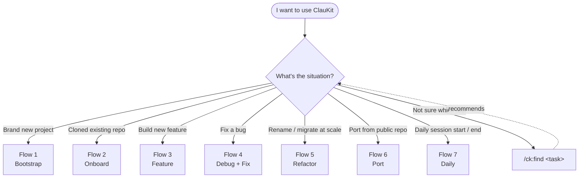
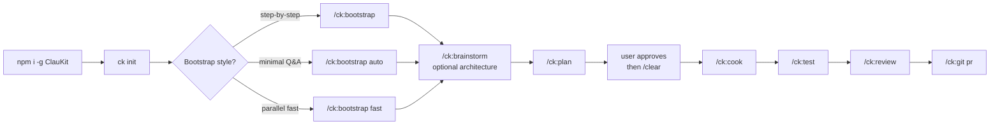
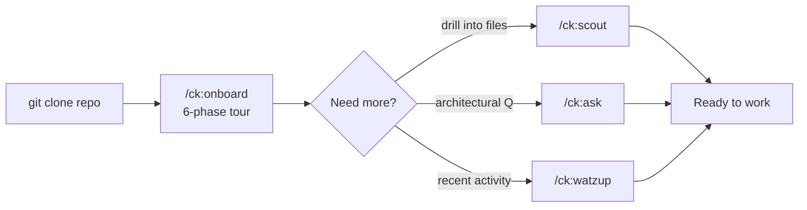
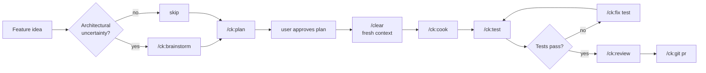
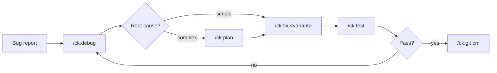
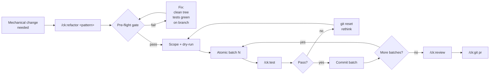
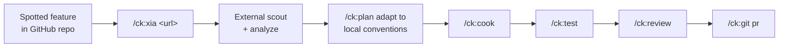
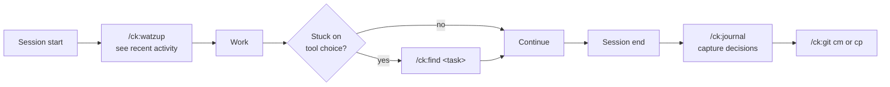

# ClauKit — The Opinionated Multi-Agent Orchestration Framework for Claude Code

*80 skills · 21 agents · 25 gated commands · atomic-commit safety · MCP-ready*

[](https://github.com/trungdo9/ClauKit/stargazers)
[](https://opensource.org/licenses/MIT)
[](https://github.com/trungdo9/ClauKit/releases)
[](https://github.com/topics/claude-code-template)

Claude Code is powerful, but raw — you're left to invent your own workflows, manage parallel agents by hand, and hope you don't `git push` a broken refactor. Most Claude Code templates throw a thousand skills at the wall and call it a day.

**ClauKit is the opinionated alternative.** 80 curated skills, 21 specialized agents, 25 gated commands — each one earns its place. Built-in pre-flight checks block destructive operations. Multi-agent orchestration via `/ck:team` runs parallel Claude Code sessions safely.

> Plan once. `/clear` context. Cook with confidence. That's the ClauKit workflow.

## Why ClauKit

- **Gated pipelines, not gambling.** `/ck:refactor` and `/ck:cook` enforce pre-flight gates — clean working tree, tests green, not on `main`. See [`.claude/workflows/primary-workflow.md`](./.claude/workflows/primary-workflow.md). Skip the gates and the command refuses to run.
- **Trio architecture — one concept, one entry point.** Every skill (knowledge) maps to an agent (persona) and a command (`/ck:<name>` trigger). No tool roulette. Full map in [`docs/clauKit-registry.md`](./docs/clauKit-registry.md).
- **Curated, not crawled.** 80 skills hand-selected for AI dev workflows — research, planning, refactoring, testing, code review, SEO, payments. Each maintained, each documented, each in the registry. No abandoned scaffolds.

## Quick Start

```bash
# 1. Install from GitHub (not yet on npm)
npm install -g https://github.com/trungdo9/ClauKit.git

# 2. Drop ClauKit into your project
cd /path/to/your-project && ck init

# 3. Launch Claude Code — try /ck:find to discover commands
claude
```

> Pull latest with `ck update`. Other install paths (npx, clone-as-template, MCP setup) are collapsed below.

<details>
<summary><strong>Other install options (npx · clone · MCP)</strong></summary>

### Prerequisites
- [Claude Code](https://code.claude.com) installed and configured
- Git for version control
- Node.js 18.0.0 or higher

### Option 2: Run without installation

```bash
npx github:trungdo9/ClauKit init
```

### Option 3: Clone and customize

```bash
git clone https://github.com/trungdo9/ClauKit.git your-project-name
cd your-project-name
claude
```

### Option 4: GitHub MCP Integration (Optional)

```bash
cp .claude/.env.example .claude/.env
# Add your GitHub Personal Access Token from https://github.com/settings/tokens/new?scopes=repo
# Edit .claude/.env and set GITHUB_TOKEN=ghp_xxx...
# Restart Claude Code to activate MCP
```

### CLI Commands

```bash
ck init              # Copy .claude folder to current directory
ck init --force      # Overwrite existing files (back up local changes first)
ck update            # Pull latest version from GitHub
ck help              # Show help information
```

> `ck init` only copies `.claude/`. Other assets shipped in the package (`.opencode/`, `AGENTS.md`, `docs/`, `CLAUDE.md`) are only available via Option 3 (clone-as-template).

</details>

---

## Use Cases & Workflows

This section maps **every common situation** a developer faces to the exact ClauKit commands to use. Start with the master decision tree, then drill into the matching flow.

### 🧭 Master decision tree — which flow do I need?



> **Lost?** Run `/ck:find <task description>` — it recommends the best skill / agent / command for your task from the local registry.

---

### Flow 1 — 🆕 Brand new project (greenfield)

Start from zero — scaffold project, decide architecture, ship first version.



**When to use**: empty folder, fresh idea. Pick `auto` if you trust ClauKit defaults; `fast` for max parallelism; default for full control.

---

### Flow 2 — 👋 Joined existing project (onboarding)

Just cloned a repo — get oriented in 10 minutes, ready to work.



**When to use**: new joiner OR returning after long absence. `/ck:onboard` reads existing docs + maps entry points + suggests first task — does NOT regenerate docs.

---

### Flow 3 — ✨ Build a new feature

Feature idea → production. Primary workflow.



**When to use**: any non-trivial change with feature semantics (new endpoint, new screen, new flow). Skip `/ck:brainstorm` for well-understood patterns.

---

### Flow 4 — 🐛 Fix a bug

Investigate → fix → verify → ship.



**`/ck:fix` variants** — pick the matching context:

| Variant | Use when |
|---|---|
| `/ck:fix ci` | GitHub Actions / CI pipeline failing |
| `/ck:fix logs` | Error logs from server / runtime |
| `/ck:fix test` | Failing tests |
| `/ck:fix types` | TypeScript / mypy errors |
| `/ck:fix ui` | UI / styling / layout issues |

Combinable flags: `--auto` · `--review` · `--quick` · `--parallel`.

---

### Flow 5 — 🔄 Refactor at scale

Rename · extract · migrate · codemod. Behavior-preserving mechanical change.



**When to use**: distinct from `/ck:cook` (feature) and `/ck:fix` (bug). If the change alters behavior → use `/ck:cook` instead. Pre-flight gate blocks if working tree dirty, tests red, or on `main`.

---

### Flow 6 — 📦 Port a feature from a public GitHub repo

Found a feature in someone else's repo, want to bring it in (and improve / adapt).



**Flags**: `--improve` (apply local-codebase patterns) · `--compare` (side-by-side diff with existing).

---

### Flow 7 — 📅 Daily working session

Resume → work → wrap up. Lightweight loop.



**Tip**: `/ck:find` is your meta-helper across 80 skills + 25 commands. Use it whenever you think "there's probably a ClauKit tool for this".

---

### 📋 Quick reference — scenario → command

Specialized journeys with single-command entry points.

| Scenario | Command | Chain after |
|---|---|---|
| 🆕 New project scaffold | `/ck:bootstrap [auto\|fast]` | → `/ck:plan` → `/ck:cook` |
| 👋 Tour codebase | `/ck:onboard [focus]` | → `/ck:scout` / `/ck:ask` |
| ❓ Codebase Q&A (read-only) | `/ck:ask <question>` | (standalone) |
| 🔍 Find files / symbols | `/ck:scout <prompt> [-ext]` | (standalone) |
| 🌐 External research | `/ck:research <topic>` | → `/ck:plan` |
| 💡 Architectural debate | `/ck:brainstorm <topic>` | → `/ck:plan` |
| 📋 Plan implementation | `/ck:plan [fast\|hard\|two\|ci\|cro]` | → `/clear` → `/ck:cook` |
| 🍳 Implement feature | `/ck:cook` | → `/ck:test` → `/ck:review` |
| 🧪 Run tests | `/ck:test` | → `/ck:fix test` if failing |
| 🔍 Code review | `/ck:review` | → `/ck:fix` |
| 🐛 Debug issue | `/ck:debug <issue>` | → `/ck:fix` |
| 🔧 Fix issue | `/ck:fix [ci\|logs\|test\|types\|ui]` | → `/ck:test` |
| 🔄 Large refactor | `/ck:refactor <pattern>` | → `/ck:test` → `/ck:review` |
| 📦 Port from GitHub | `/ck:xia <url> [--improve\|--compare]` | → `/ck:cook` |
| 🎨 UI / UX design | `/ck:design [fast\|good\|3d\|...]` | → `/ck:cook` |
| 🖼 Fix UI issue | `/ck:fix ui` | → `/ck:test` |
| 📚 Init docs | `/ck:docs init` | (one-shot) |
| 📚 Update docs | `/ck:docs update` | (after feature) |
| 📚 Docs summary | `/ck:docs summarize` | (read-only) |
| ✍️ Marketing copy | `/ck:content [fast\|good\|enhance\|cro]` | (standalone) |
| 🔎 SEO work | `/ck:seo [audit\|keywords\|schema] <target>` | → `/ck:content cro` |
| 💳 SePay payment | `/ck:sepay <tasks>` | → `/ck:test` |
| 🔌 Use MCP server | `/ck:use-mcp <server-name>` | (standalone) |
| 👥 Parallel team | `/ck:team <template> [...]` | (orchestration) |
| 🧩 Create / edit skill | `/ck:cc-skill [create\|add\|optimize\|fix-logs]` | (extend ClauKit) |
| 📝 Write journal | `/ck:journal` | (end-of-session) |
| 📊 Recent changes | `/ck:watzup` | (start-of-session) |
| 📤 Git commit | `/ck:git cm` | (or `cp` to push) |
| 🔀 Open PR | `/ck:git pr [to] [from]` | (after `cm`) |
| 🔀 Merge PR | `/ck:git merge [pr#\|branch]` | (interactive) |
| 🤷 Don't know which tool | `/ck:find <task>` | recommends + chains |

---

### 🎯 Workflow patterns at a glance

**The trio rule**: most concepts have a `skill` (knowledge) + `agent` (persona) + `command` (trigger). Always start with the command — the skill/agent activate automatically. See [`docs/clauKit-registry.md`](./docs/clauKit-registry.md) for the full map.

**Plan → /clear → Cook**: for non-trivial features, always plan first, then `/clear` to reset context, then implement. This is enforced in `primary-workflow.md`.

**Gated pipelines**: `/ck:refactor` and `/ck:cook` enforce pre-flight + verification gates. Don't bypass — they exist because skipping them caused incidents.

**Dispatcher commands** (positional args, no dash): `/ck:plan`, `/ck:fix`, `/ck:git`, `/ck:docs`, `/ck:cc-skill`, `/ck:seo`, `/ck:content`, `/ck:design`, `/ck:bootstrap`, `/ck:scout`. Only `/ck:fix` uses combinable `--flags`.

## Project Structure

```
claukit/
├── .claude/                    # Claude Code configuration
│   ├── agents/                 # Specialized agent definitions (21 agents)
│   ├── commands/               # Slash command implementations (25 commands)
│   ├── hooks/                  # Git hooks and scripts
│   ├── skills/                 # Specialized skills library (80 skills)
│   ├── workflows/              # Development workflow definitions
│   ├── settings.json           # Claude Code settings
│   ├── metadata.json           # Project metadata
│   ├── .env.example            # Environment template
│   ├── .gitignore              # Git exclusions
│   ├── .mcp.json.example       # MCP configuration template
│   ├── statusline.sh           # Bash statusline script
│   ├── statusline.ps1          # PowerShell statusline script
│   └── statusline.js           # Node.js statusline script
├── .opencode/                  # OpenCode CLI configuration
│   ├── agent/                  # Agent definitions
│   └── command/                # Command definitions
├── .github/                    # GitHub configuration
│   └── workflows/              # CI/CD workflows
├── docs/                       # Project documentation
├── plans/                      # Implementation plans and reports
├── scripts/                    # Setup and utility scripts
├── CLAUDE.md                   # Project instructions for Claude
├── README.md                   # This file
├── package.json                # Node.js dependencies
├── .releaserc.json             # Semantic release configuration
├── .commitlintrc.json          # Commit linting rules
├── CHANGELOG.md                # Version history
└── LICENSE                     # MIT License
```

## Core Features

### AI Agent System

**21 Specialized Agents**:

| Category | Agents |
|----------|--------|
| Planning | `planner`, `researcher`, `brainstormer` |
| Development | `frontend-developer`, `backend-developer` |
| Quality | `tester`, `code-reviewer`, `debugger`, `performance-agent`, `security-auditor` |
| Documentation | `docs-manager`, `journal-writer` |
| Operations | `git-manager`, `project-manager`, `database-admin`, `mcp-manager`, `integration-agent` |
| Implementation | `scout`, `scout-external`, `ui-ux-designer` |
| Specialized | `copywriter` |

### Slash Commands (26)

All dispatcher commands use **positional args** (no dash prefix) for mode selection. Only `/ck:fix` uses `--flags` for combinable modifiers.

| Command | Modes / Usage |
|---------|---------------|
| `/ck:ask` | `<question>` |
| `/ck:bootstrap` | `[auto\|fast]` |
| `/ck:brainstorm` | `<topic>` |
| `/ck:cc-skill` | `[add\|create\|optimize\|fix-logs] <args>` |
| `/ck:content` | `[fast\|good\|enhance\|cro] <request>` |
| `/ck:cook` | `[task or plan-path] [--fast\|--auto\|--from-plan\|--no-test]` |
| `/ck:debug` | `<issue>` |
| `/ck:design` | `[fast\|good\|3d\|screenshot\|describe\|ui-ux-pro-max] <request>` |
| `/ck:docs` | `[init\|update\|summarize]` |
| `/ck:find` | `<task-description>` |
| `/ck:fix` | `[ci\|logs\|test\|types\|ui] [--auto] [--review] [--quick] [--parallel] <issue>` |
| `/ck:git` | `[cm\|cp\|pr\|merge]` |
| `/ck:journal` | `(no args)` |
| `/ck:onboard` | `[optional-focus-area]` |
| `/ck:plan` | `[fast\|hard\|two\|ci\|cro] <task>` |
| `/ck:refactor` | `<refactor-pattern>` |
| `/ck:research` | `<topic>` |
| `/ck:review` | `[tasks-or-prompt]` |
| `/ck:scout` | `<prompt> [scale] [-ext]` |
| `/ck:seo` | `[audit\|keywords\|schema] <target>` |
| `/ck:sepay` | `<tasks>` |
| `/ck:team` | `<template> [context] [--devs\|--reviewers\|--researchers\|--debuggers N]` |
| `/ck:test` | `(no args)` |
| `/ck:use-mcp` | `<server-name>` |
| `/ck:watzup` | `(no args)` |
| `/ck:xia` | `<github-url> [feature] [--improve\|--compare]` |

### Workflows

- **Primary Workflow** (`primary-workflow.md`) - Implementation cycle
- **Development Rules** (`development-rules.md`) - Coding standards
- **Orchestration Protocols** (`orchestration-protocol.md`) - Agent coordination
- **Documentation Management** (`documentation-management.md`) - Doc maintenance

## Development Principles

- **YANGI** - You Aren't Gonna Need It
- **KISS** - Keep It Simple, Stupid
- **DRY** - Don't Repeat Yourself
- Files under 200 lines for optimal context management
- Try-catch error handling
- Security-first development

## Configuration

### Claude Code Settings

Configure in `.claude/settings.json`:

```json
{
  "hooks": {
    "BeforeBash": [{
      "type": "command",
      "command": "node ${CLAUDE_PROJECT_DIR}/.claude/hooks/scout-block.js"
    }]
  }
}
```

### Environment Variables

Copy `.claude/.env.example` to `.claude/.env` and configure:

- `ANTHROPIC_API_KEY` - Anthropic API key
- `GEMINI_API_KEY` - Google Gemini API key (optional)

## Documentation

All documentation is maintained in `./docs`:

- [Project Overview & PDR](./docs/project-overview-pdr.md)
- [Codebase Summary](./docs/codebase-summary.md)
- [Code Standards](./docs/code-standards.md)
- [System Architecture](./docs/system-architecture.md)
- [Project Roadmap](./docs/project-roadmap.md)
- [Design Guidelines](./docs/design-guidelines.md)
- [Deployment Guide](./docs/deployment-guide.md)

## Dependencies

**Development**:
- `@commitlint/cli` ^18.4.3
- `@semantic-release/*` packages
- `husky` ^8.0.3
- `semantic-release` ^22.0.12

## License

MIT License - see LICENSE file for details.

## Support

- GitHub Issues: https://github.com/trungdo9/ClauKit/issues
- Repository: https://github.com/trungdo9/ClauKit
